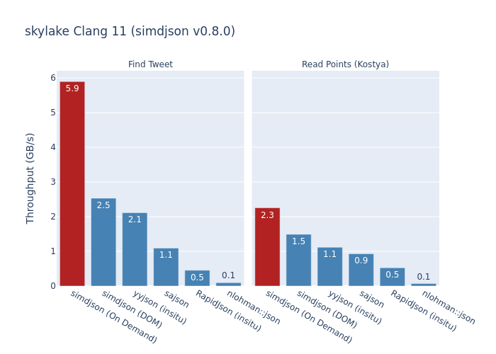

# JSON Benchmarks

Benchmarks results of real world scenarios for many JSON parsers, including iteration and use of the results.



## Rationale

JSON parsers not only parse JSON, they also present APIs to *use* it. Once it's been parsed, you have to iterate over its arrays, look up values in objects, and ultimately extract strings, floating-point numbers, etc.

JSON *benchmarks* typically only measure how long a parser takes to *read* a JSON file. Even for the many parsers that read JSON into a tree, some trees are faster than others, meaning you need to measure how long it takes to (for example) look up object fields.

More importantly, there are JSON parsers that can't be evaluated without using the data! SAX parsers like those offered by [RapidJson](https://rapidjson.org/md_doc_sax.html) and [nlohmann_json](https://github.com/nlohmann/json#sax-interface) don't have to produce a tree at all, and may even stop early if you are finished with the document. Some parsers, like simdjson's On Demand, can even skip parsing unused values, saving a lot of time.

## Benchmarks

The benchmark results encompass these scenarios:

| Benchmark | Scenario | Test Features | Example JSON | Document Features Tested |
|---|---|---|---|---|
| large_random     | Show all points | Read All Fields | `[ { "x": 0.1, "y": 0.2, "z": 0.3 } ]` | Floating-Point, Many Small Objects |
| kostya           | Show all points | Skip One Field  | `[ { "x": 0.1, "y": 0.2, "z": 0.3, "text": "blah" } ]`| Many Small Objects, Floating-Point |
| partial_tweets   | Show all tweets | Skip Most Fields | `{ "statuses": [ { "id": 1231, "user": { "id": 4522, "screen_name": ... }, "text": ... } ... ], ... }` | Few (~100) Large Objects, UTF-8, Escape Characters, Large Integers |
| distinct_user_id | Show user IDs | Nesting, Skip Most Fields | `{ "statuses": [ { "user": { "id" ... }, "in_reply_to": { "user": { "id": 524 ... } ... } ... } ... ] ... }` | Few (~100) Large Objects, Deep Nesting, Large Integers |
| top_tweet | Display tweet with the highest # retweets | Lazy Parsing | `{ "statuses": [ { "id": 1231, "user": { ... }, ... }, ... ], ... }` |
| find_tweet | Find tweet with given ID | Stop Early | `{ "statuses": [ { "id": 1231, "user": { ... }, ... }, ... ], ... }` |

### Repository Organization

Each benchmark contains two main files: `<host>-<compiler>[-<variant>].json`, and `<host>-<compiler>[-<variant>].out`. The JSON file is the actual Google Benchmark results (unmodified), and the .out file is the output of cmake, make, etc. so that we can be sure we're running what we think we're running.

## Running Benchmarks

To collect a set of results, we go to the top-level directory of this repository and run:

```bash
git clone https://github.com/simdjson/simdjson
./run_benchmark_official.sh <host> <simdjson version> [<git commit>] [<compilers>] [<variants>]
```

(The git clone only needs to be run the first time.)

The parameters:

* `<host>` is the name of the host for identification purposes--e.g. `skylake`, `skylake-x`, `ampere`. This is freeform and can contain any value.
* `<simdjson version>` is the version of simdjson the commit is based off of, e.g. `v0.7.0`. It should match the actual git tag of the simdjson version.
* `<git commits>` is the set of commits you want to test, separated by spaces. For example, `"v0.8.0~1 v0.8.0~2"` will test the two commits just before v0.8.0. The script will calculate how many commits they are from the simdjson version. If this is not specified or is empty, it releases to the simdjson version (e.g. `<v0.8.0>`).
* `<compilers>` is the set of compilers you want to run, separated by spaces. Valid values are clang6, clang7, clang8, clang9, clang10, clang11 gcc7, gcc8, gcc9 and gcc10.2. If this is not specified or is empty, it releases to `"clang11 gcc10.2"`.
* `<variants>` are variants of simdjson you want to test, separated by spaces. If this is not specified or is empty, it releases to `release`. Valid values are:
  - `release`: compile release build.
  - `debug`: compile debug build.
  - `native`: compile release build with `-march=native`.
  - `fallback`: compile release build with -DSIMDJSON_IMPLEMENTATION=fallback.
  - `westmere`: compile release build with -DSIMDJSON_IMPLEMENTATION="westmere fallback".

The output files will automatically be collected in the right places.

The v0.7.0 and v0.8.0 benchmarks on skylake were collected by running:

```
host=skylake
./run_benchmark_official.sh $host v0.8.0 "" "clang10 clang11 gcc10.2" "release native fallback westmere debug"
./run_benchmark_official.sh $host v0.7.0 "" "clang10 clang11 gcc10.2" "release native fallback westmere debug"
./run_benchmark_official.sh $host v0.7.0 "v0.8.0~1 v0.8.0~5 v0.8.0~10 v0.8.0~15 v0.8.0~20 v0.8.0~25 v0.8.0~30 v0.8.0~35" "" "release native"
```

### Generating .pngs

When all the new .out and .json files are in the directory, you can run graph_benchmarks.py to generate pngs. You will need several libraries first.

```bash
pip3 install pandas plotly kaleido
python graph_benchmarks.py
```

### Python Notebook

`simdjson_perf.ipynb` is a Jupyter notebook that lets you preview the graphs. Install jupyter (`pip3 install jupyter pandas plotly kaleido`) and open it in Jupyter or Visual Studio Code.
